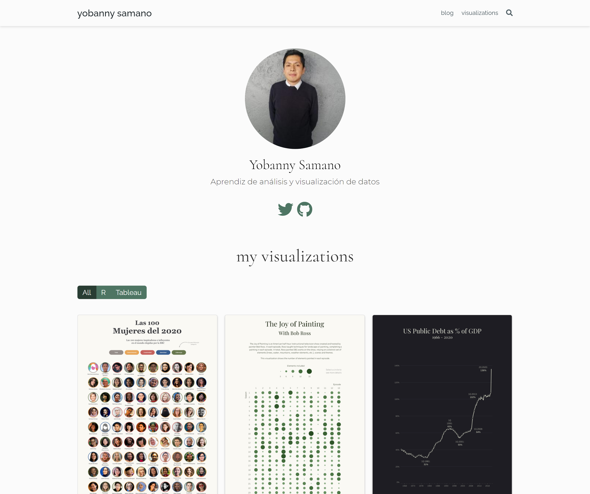

[Mi sitio web](https://ysamano.rbind.io/) fue construido en R con el paquete [`blogdown`](https://github.com/rstudio/blogdown). Agradecimiento especial a [Alison Hill](https://alison.rbind.io/) por su excelente [tutorial](https://alison.rbind.io/post/new-year-new-blogdown/).

